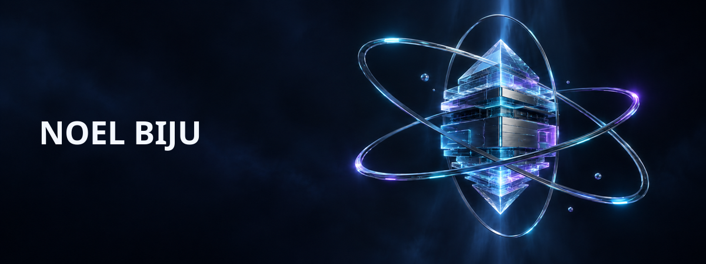

  <picture>
    <source srcset="./assets/profile-hero.gif" type="image/gif" />
    
  </picture>

**Software builder · systems explorer · professional overthinker of side projects**

[Portfolio](https://noelbiju.in) · [GitHub](https://github.com/noel-ult) · [LinkedIn](https://www.linkedin.com/in/noel-biju-788b81332)

  

**Explore the builds**

[PageRadar](https://github.com/noel-ult/PageRadar) · [EtlabPro](https://github.com/noel-ult/EtlabPro) · [VERITAS AI](https://github.com/noel-ult/Veritas-ai) · [Choru Vaari Kodukkam](https://github.com/noel-ult/chooru-varal)

Build first. Understand deeply. Refactor relentlessly.

