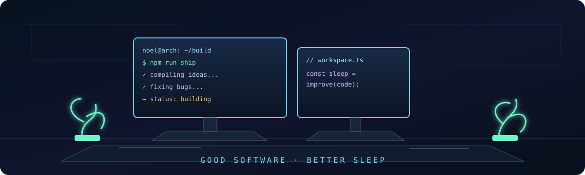

<div align="center">
  
</div>

```text
noel-ult@github:~$ whoami

NOEL BIJU
Computer Science Student · Developer · Builder · AI Explorer

I turn ideas into software, break them, figure out why,
and occasionally build something completely unnecessary.
```

<div align="center">
  <a href="https://noelbiju.in">PORTFOLIO</a> ·
  <a href="https://github.com/noel-ult">GITHUB</a> ·
  <a href="https://www.linkedin.com/in/noel-biju-788b81332">LINKEDIN</a>
</div>

---

## 01 / currently

```console
$ systemctl --user status noel

● noel.service — builder mode
   Active: active (running)

> building PageRadar — intelligent web monitoring
> exploring AI systems and developer tooling
> learning distributed systems, cloud, and ML
> experimenting with computer vision and weird ideas
> running Linux (Arch btw)
```

## 02 / featured

| PROJECT | WHAT IT DOES | STACK | SOURCE |
| :-- | :-- | :-- | :-- |
| **PageRadar** | Monitors public HTML pages. It stores an immutable baseline, then records changed content as new snapshots, `CONTENT_CHANGED` events, and check history. | Next.js · NestJS · Apollo GraphQL · Prisma · Supabase PostgreSQL · Docker/Dokploy | [open ↗](https://github.com/noel-ult/PageRadar) |
| **EtlabPro** | Full-stack companion for Sahrdaya ETLAB users: authenticated sync, attendance, CAT and semester results, calendar, timetable, and analytics. | Flutter · FastAPI · Supabase · ETLAB scraping · JWT · Dokploy | [open ↗](https://github.com/noel-ult/EtlabPro) |
| **VERITAS AI** | Evidence-driven technical interviewing: adaptive questions, evidence extraction, competency verification, telemetry, and printable assessment reports. | Next.js 15 · FastAPI · Framer Motion · Docker · Dokploy | [open ↗](https://github.com/noel-ult/Veritas-ai) |

```text
PageRadar note: the monitor currently runs in-process for one API instance.
Public HTTP/HTTPS HTML pages only. Distributed scheduling comes before replicas.
```

## 03 / more projects

- `[ AI_BUDDY ]` Python assistant experiment — [source](https://github.com/noel-ult/AI_BUDDY)
- `[ DevOps ]` Containerized Express task API with GitHub Actions validation — [source](https://github.com/noel-ult/DevOps)
- `[ AI Study Coach ]` Study-session analytics and coaching app with Flask, React Native, and Expo — [source](https://github.com/noel-ult/AI-Study-Coach-)
- `[ Chaotic Mouse Game ]` Java/Swing desktop experiment for deliberately chaotic cursor interactions — [source](https://github.com/noel-ult/ChaoticMouseGame)
- `[ AWS Cloud ]` Small Flask + Docker cloud project — [source](https://github.com/noel-ult/aws-cloud)
- `[ portfolio ]` Personal portfolio built with Next.js — [source](https://github.com/noel-ult/portfolio)

## 04 / engineering stack

```yaml
languages:  [Python, TypeScript, JavaScript, Java, C++, SQL]
frontend:   [React, Next.js, Flutter, Tailwind CSS]
backend:    [FastAPI, NestJS, Node.js, GraphQL, Flask]
ai_vision:  [MediaPipe Tasks Vision]
data:       [PostgreSQL, Supabase, Prisma, SQLite]
infra:      [Docker, GitHub Actions, Linux, Dokploy, AWS]
```

## 05 / developer.config

```ini
[developer]
name      = "Noel Biju"
role      = "developer"
focus     = ["full-stack", "AI", "systems"]
editor    = "VS Code"
os        = "Linux"
shell     = "terminal"
currently = "building"
status    = "shipping, debugging, repeating"
```

## 06 / philosophy

> Build first. Understand deeply. Debug the cause instead of decorating the symptom.

I like systems that can be explained, inspected, and changed without fear. That means making the first useful version, tracing the weird failures, refactoring the rough edges, and saving space for experiments that sound slightly ridiculous.

## 07 / telemetry

```text
github.com/noel-ult
├── full-stack product work
├── AI and computer-vision experiments
├── cloud and container workflows
└── a healthy disregard for boring project ideas
```

## 08 / journey

| STAGE | SIGNAL |
| :-- | :-- |
| **foundation** | Computer Science, systems, and hands-on software building. |
| **full stack** | Product work across web, mobile, databases, and deployment. |
| **now** | PageRadar, EtlabPro, VERITAS AI, computer vision, cloud work, and hackathon experiments. |

<div align="center">
  
</div>

```text
Build first.
Understand deeply.
Refactor relentlessly.

KEEP BUILDING <3
```
